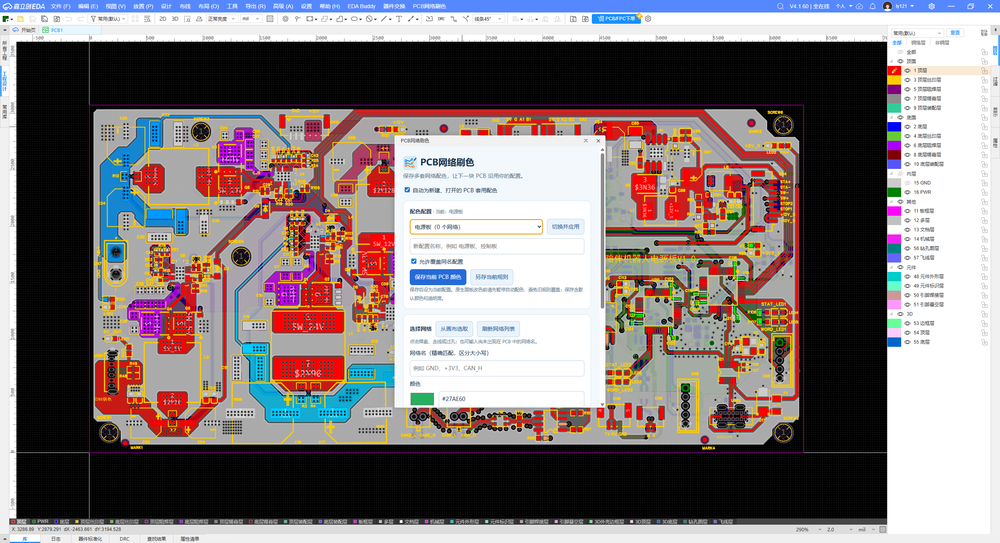

# PCB网络刷色

[嘉立创扩展导航](https://github.com/ly12121/jlc-extensions) · [源码仓库](https://github.com/ly12121/pcb-net-color) · [安装包下载](./release/)

作者：LIYAN · 版本：1.1.5 · 嘉立创 EDA 专业版扩展

给网络设置显示颜色，保存网络名与颜色的对应规则。可点击 PCB 的焊盘、走线、圆弧、过孔等带网络的图元选取网络；也可以从网络列表选择或手动输入名称。设置 GND 为绿色后，后续 PCB 中的 GND 可自动变绿。

## 安装及使用

1. 在“高级 → 扩展管理器 → 导入”中导入 `pcb-net-color-brush_v1.1.5.eext`，启用扩展，重启编辑器一次。
2. 打开 PCB，使用顶部菜单“PCB网络刷色 → 打开网络配色窗口”。窗口不遮挡画布操作，可以持续选取网络。
3. 点击焊盘、走线或过孔，窗口显示网络名称。点击整个器件不代表选中了某个引脚网络，请直接点击焊盘。多个网络同时选中时，需从窗口的下拉框指定一个。
4. 选择颜色或输入 `#RRGGBB`，点击“保存配色并应用”。允许给当前不存在的网络提前保存规则。
5. 保持“自动为新建、打开的 PCB 套用配色”勾选。后台通常在约 2 秒内处理当前活动 PCB，包括随后导入或新增的网络；大板或编辑器忙碌时可能稍久。
6. 关闭配色窗口后后台继续工作；停止自动配色可取消勾选，或禁用扩展。手动“保存配色并应用”和“套用全部规则”仍可在自动模式暂停时使用。

## 配色记忆与范围

### 保存和切换多套配置

1. **保存当前 PCB 颜色**：打开目标 PCB，输入配置名称，点击此按钮；读取当前 PCB 的所有具名网络及实际颜色，包括默认颜色（null）和不透明度。保存本身不写 PCB，保存后设为当前配置。读取期间若换文档或颜色变化，会取消保存并提示重试。
2. **另存当前规则**：把扩展当前规则复制成新名称，包含当前 PCB 尚不存在的网络，原配置保留。
3. **切换并应用**：下拉选择配置，点击此按钮；当前 PCB 按网络名套用选中配置。开启自动配色时，后续打开、新建 PCB 也使用此配置。未出现在配置中的网络保持原色，不会全板重置。
4. 同名保存默认拒绝；确认要覆盖时勾选“允许覆盖同名配置”。保存 PCB 时，名称留空且勾选覆盖会保存到下拉框所选配置；填写新名称可以另存。空规则不能另存，请使用“保存当前 PCB 颜色”读取画布配色。修改单个网络只更新当前配置，其他配置不变。
5. 在 EDA 原生面板手工调整颜色之前，请先暂停本扩展自动配色，否则后台会重新套用旧规则。调整后保存 PCB 快照，再按需开启自动配色。读取快照时会短暂阻止新的后台刷色写入。
6. 升级时旧规则迁移为“默认配置”，第一次写入新版前在扩展用户配置中保留旧版备份。完整导出包含所有配置、当前选择及自动开关；导入按配置名和网络名合并，不切换当前配置、不删除其他规则。建议升级前另行导出备份；不要直接降级读取新版配置。

### 图标

内置 imagegen 生成，提示词：浅蓝背景、蓝绿橙三条带圆形焊盘的 PCB 走线、小刷子、简洁清晰、无文字无品牌标志、正方形 PNG。文件 `images/logo.png` 已随安装包和源码打包。

- 网络名精确匹配，区分大小写，保留名称原始空格；空白名称不接受。
- 使用扩展用户配置保存规则，跨工程使用且重启后保留。不同电脑或编辑器环境不承诺自动云同步，可用“配色备份 / 迁移”复制 JSON 导入导出。
- 自动模式会在活动 PCB 中维持已定义的颜色，包括已有 PCB。其他网络不修改；未打开的文档在打开并成为活动 PCB 后才处理。
- 删除规则只停止自动套用，不清除当前 PCB 已显示的颜色。可以继续用 EDA 原生网络面板更改颜色。
- 只调用网络颜色接口，不改网表、网络连接、器件位置、层颜色或铜层。
- 保存规则成功与 PCB 应用成功分别反馈；网络不存在会跳过但保留规则，设置失败显示网络名并允许再次手动应用。

## 环境和限制

需要支持 `PCB_Net.getAllNets/setNetColor`、`SYS_Storage`、`SYS_Timer` 和编辑器事件的专业版。部分接口官方标记为 Beta，具体显示效果需在实际 EDA 版本验证；本次自动化验证使用模拟 API，不代替编辑器实测。网络高亮或选择效果可能临时覆盖颜色，请取消选中观察。

新扩展使用独立 UUID，不覆盖“器件交换”。初版提供可安装包和源码，尚未提交扩展广场审核。

## 构建

Node.js 20 或更新版本：`npm install`，`npm test`，`npm run build`。输出在 `release`。测试覆盖配置持久化、跨 PCB 复用、后增网络、失败重试、文档切换与停用处理。

官方接口：[网络颜色](https://prodocs.lceda.cn/cn/api/reference/pro-api.pcb_net.setnetcolor.html)、[扩展存储](https://prodocs.lceda.cn/cn/api/reference/pro-api.sys_storage.html)、[扩展定时器](https://prodocs.lceda.cn/cn/api/reference/pro-api.sys_timer.setintervaltimer.html)。

## 配置管理与窗口

选择配置后点击“删除”，再次确认即可删除；PCB 颜色不变。删除当前配置会暂停自动配色；最后一套删除后保留空的默认配置。

窗口为 420×560，默认右上方并预留右侧面板空间，可拖动调整。规则和详细说明默认折叠。

## 色板

点击颜色预览块打开 240 色色板（24 个灰阶、216 个彩色），点击色块选色，点击“保存并应用”生效。支持默认色、#RRGGBB 输入和不透明度。

## 功能演示

上图为用户提供的早期版本实际使用截图，用于展示 PCB 网络颜色与配置功能；当前版本为紧凑窗口和 240 色色板，界面有所不同。

## 画布选网与过滤恢复

打开窗口或点击“画布选取”后，临时启用焊盘、过孔、导线、铺铜选择，并暂停器件整体选择。无需事先修改“仅元件”过滤。关闭窗口、转为手动输入网络名，或点击 EDA 主界面的其他控件时恢复此前被临时修改的过滤项；再次选网请点“画布选取”。不改变图层可见性、锁定状态或保存的过滤预设。

此兼容功能依赖 EDA 过滤面板结构：若面板未加载、接口结构变化或无法访问，会明确提示手动勾选，不盲目修改其他控件。异常退出编辑器不能保证执行恢复，请检查过滤面板。本版自动测试通过，但临时过滤及关闭恢复仍需在实际 EDA 中验证。
